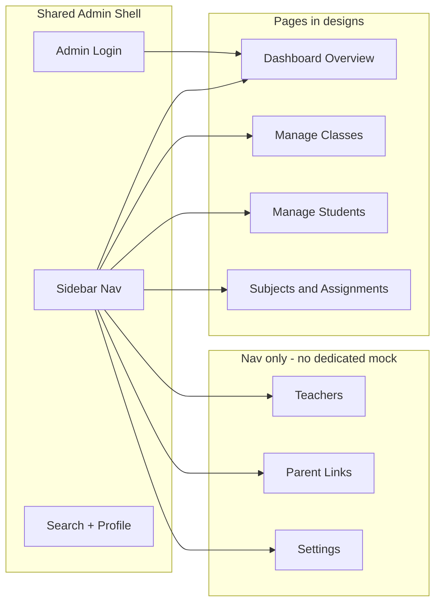
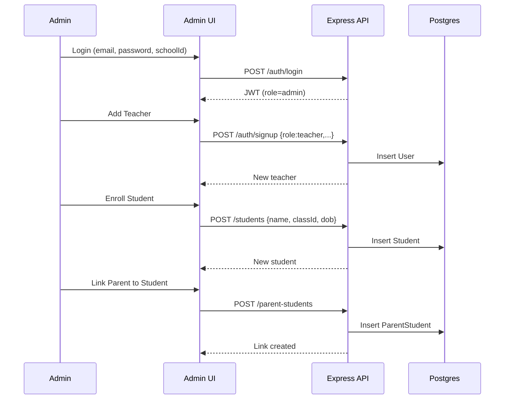

# Admin Portal — Design Review and Phased Build Plan

## What the designs describe

The [`screens/admin_page/`](screens/admin_page/) folder is a cohesive **RollCall Admin Portal** with a shared shell (260px dark sidebar, top search bar, notifications/help, admin profile) and Hanken Grotesk + indigo design system documented in [`screens/admin_page/rollcall_admin/DESIGN.md`](screens/admin_page/rollcall_admin/DESIGN.md).



### Screen-by-screen feature inventory

| Screen | Core admin actions implied | Extra / decorative UI |
|--------|---------------------------|------------------------|
| [`admin_login`](screens/admin_page/admin_login/code.html) | School ID + email + password login, inline auth errors, remember-me | Forgot password, support links |
| [`admin_dashboard_overview`](screens/admin_page/admin_dashboard_overview/code.html) | Stats (students/teachers/classes/subjects), quick “Add Student”, live class table | Trend %, recent activity feed, system health, broadcast/ID cards/emergency, support chat FAB, map widget |
| [`manage_students`](screens/admin_page/manage_students/code.html) | Enroll student, list/edit/delete, filter by class, pagination | Roll numbers, student emails, parent verification status, academic standing badges, CSV export, enrollment growth widgets |
| [`manage_classes`](screens/admin_page/manage_classes/code.html) | Add class, list/edit/delete, assign teacher | Grade level, room number, schedule, room-conflict stats, calendar drag-drop |
| [`subjects_assignments`](screens/admin_page/subjects_assignments/code.html) | Create subject, create teaching assignment (teacher + subject + class) | Subject codes, departments, period/schedule on assignment, department coverage stats |

**Important distinction the designs blur:** “Students” in RollCall are **records** (name, class, DOB) — not login accounts. **Teachers and parents** are **User accounts** created via `POST /auth/signup` (admin-only). The student table mock shows emails and roll numbers that **do not exist** in [`backend/prisma/schema.prisma`](backend/prisma/schema.prisma) today.

---

## What you already have (good news)

### Backend — largely ready for MVP admin UI

| Feature | API | Status |
|---------|-----|--------|
| Admin login | `POST /auth/login` | Done |
| Create teacher/parent accounts | `POST /auth/signup` (admin JWT, role `teacher` or `parent`) | Done — **not wired in frontend yet** |
| Classes CRUD | `/classes` | Done |
| Students CRUD | `/students` | Done |
| Teachers list | `GET /teachers` | Done (list only) |
| Subjects + teaching assignments | `/grades/subjects`, `/grades/teaching-assignments` | Done |
| Parent ↔ student links | `/parent-students` | Done |

### Frontend — functional but not design-faithful

[`frontend/react/src/pages/AdminDashboard.jsx`](frontend/react/src/pages/AdminDashboard.jsx) is a **single scroll page** with hash anchors that already calls most admin APIs — but it:

- Has **no teacher/parent signup forms** (teachers are read-only)
- Uses **raw numeric IDs** for teacher assignment and parent linking
- Lumps all sections on one page instead of separate routes
- Does not match the visual design (sidebar/topbar exist in CSS but layout is minimal)

[`frontend/react/src/App.jsx`](frontend/react/src/App.jsx) already routes admins to `/admin` after login via a shared [`Login`](frontend/react/src/App.jsx) page (supports `schoolId`).

---

## My read: what to build vs defer

### Build now (Phase A — MVP, matches your “phased” choice)

These align with [`context/build-plan.md`](context/build-plan.md) Phase 1 item 5 (“minimal UI”) and your stated goal of adding students, parents, and teachers:

1. **Admin shell component** — persistent sidebar + topbar matching designs; React Router nested routes under `/admin/*`
2. **Dashboard** — real stat counts from API; quick links to “Add Student”, “Add Teacher”, “Add Parent”; skip fake system-health/activity feed or show static placeholders labeled clearly
3. **Students page** — enroll form (name, class dropdown, DOB), table with edit/delete using existing CRUD; client-side search/filter by class name
4. **Teachers page** — list teachers + **“Add Teacher” modal** calling `POST /auth/signup` with `{ name, email, password, role: 'teacher' }`
5. **Parents page** (or combined “Users” tab) — **“Add Parent” modal** via signup with `role: 'parent'`
6. **Classes page** — create/edit/delete class; assign teachers via multi-select (not comma-separated IDs)
7. **Subjects & Assignments page** — subject create modal + assignment create modal (class + teacher + subject dropdowns), matching [`subjects_assignments/code.html`](screens/admin_page/subjects_assignments/code.html) layout
8. **Parent Links page** — link parent user to student with dropdowns (not raw IDs)
9. **Polish login errors** — adopt the error banner pattern from [`admin_login`](screens/admin_page/admin_login/code.html) on the existing login page when role is admin

### Defer to Phase B (polish, no schema changes)

- Pagination (client-side is fine initially)
- Export CSV
- Dedicated admin-branded login page (optional skin on existing `/login`)
- Strip decorative dashboard widgets or replace with “coming soon”
- `/imprint` pass to capture design tokens in `ui-registry.md`

### Defer to Phase C / later build-plan items (needs schema + new APIs)

These appear in designs but are **out of current data model** — building them would expand scope beyond Phase 1:

- Student roll numbers, enrollment status, academic standing
- Class room numbers, grade levels, schedules, room-conflict detection
- Subject codes, departments, assignment period/schedule fields
- Live attendance monitoring on dashboard (needs aggregation endpoint)
- Settings, forgot password, broadcast, ID cards, support chat

Per project rules: call these out explicitly before building — don’t quietly add them because the mock shows them.

---

## Recommended file structure

```
frontend/react/src/
  pages/admin/
    AdminLayout.jsx          # shell: sidebar, topbar, <Outlet />
    AdminDashboard.jsx       # overview stats + quick actions
    AdminStudents.jsx
    AdminTeachers.jsx        # list + signup form
    AdminParents.jsx         # list + signup form (or merge with Teachers)
    AdminClasses.jsx
    AdminSubjects.jsx        # subjects + assignments split view
    AdminParentLinks.jsx
  api/apiClient.js           # add signup() helper
  App.jsx                    # nested /admin routes
  styles.css                 # extend existing admin-* classes to match DESIGN.md
```

Refactor the current monolithic [`AdminDashboard.jsx`](frontend/react/src/pages/AdminDashboard.jsx) into this structure rather than growing the single file.

---

## Data flow (MVP)



---

## Risks and decisions to lock early

1. **Parents vs students** — Admin creates parent *accounts* separately, then links them to student *records*. The design’s “parent contact verified” column needs parent-link data, not student email.
2. **Teachers page has no mock** — Recommend mirroring the students table pattern: name, email, phone, created date, actions (no delete unless backend supports it — verify before building).
3. **No dedicated parent list API** — May need `GET /users?role=parent` or filter client-side from a new endpoint; check if `listTeachers` pattern can be replicated for parents before building Parent Links dropdowns.
4. **Stay in phase** — Dashboard “live monitoring” and analytics widgets belong in build-plan Phase 5, not this slice.

---

## Suggested build order

1. Admin layout + routing shell (visual foundation)
2. Teachers + Parents signup (your top ask; unblocks parent links)
3. Students + Classes CRUD pages (core enrollment)
4. Parent Links with proper dropdowns
5. Subjects & Assignments page
6. Dashboard overview wired to real counts
7. Login error polish + `/imprint` design token capture
